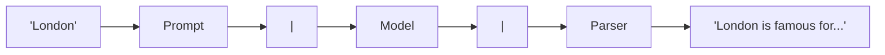

# 2.1 LangChain Expression Language (LCEL)

### Introduction
LCEL is the **"Conveyor Belt"** of LangChain. It allows you to chain multiple components together so data flows perfectly from one to the next.

If you understand the **Pipe (`|`)**, you understand 90% of LangChain.

### Objective
Deeply understand the three core components of a LangChain pipeline and why the "Pipe" makes them so powerful.

---

### 🎨 The "Three-Musketeers" Concept
Think of an AI pipeline like a **Professional Kitchen**:

#### 1. The Prompt (The Recipe)
- **What it is:** A template that takes raw user input and "decorates" it with instructions.
- **Why we need it:** If a user says "London", the LLM doesn't know if they want a travel guide, a weather report, or a history lesson. The **Prompt** wraps "London" in instructions like: *"You are a helpful tour guide. Summarize why I should visit: {city}"*.
- **Role:** Transforming "Messy Input" into "Structured Instruction".

#### 2. The Model (The Chef)
- **What it is:** The LLM (OpenAI, Azure, or Ollama).
- **Why we need it:** This is the intelligence. It reads the instructions from the Prompt and generates a response.
- **Role:** Transforming "Instructions" into "Raw Text Output".

#### 3. The Parser (The Plater / Food Critic)
- **What it is:** A tool that "cleans up" the LLM's raw response.
- **Why we need it:** LLMs are talkative. They might say: *"Sure! Here is your summary: London is a great city..."*. A **Parser** cuts out the "Sure!" and only gives you the useful text, or turns it into JSON for your database.
- **Role:** Transforming "Raw Text Output" into "Clean Data".

---

### ⛓️ The Pipe Operator (`|`)
The pipe symbol `|` is the **Conveyor Belt**. It means: *"Take the result of the thing on the left and immediately feed it as input to the thing on the right."*



### Example
```python
from langchain_core.prompts import ChatPromptTemplate
from langchain_openai import ChatOpenAI
from langchain_core.output_parsers import StrOutputParser

# 1. SETUP THE COMPONENTS
prompt = ChatPromptTemplate.from_template("Tell me a fun fact about {topic}")
model = ChatOpenAI(model="gpt-4o")
parser = StrOutputParser() # This ensures we get a simple string, not a complex object

# 2. THE PIPE (The Conveyor Belt)
# Prompt output -> Model input
# Model output -> Parser input
chain = prompt | model | parser

# 3. RUN IT
result = chain.invoke({"topic": "Ice Cream"})
print(result)
```

### 2 Use Cases
1. **Data Cleaning:** Using a `JsonOutputParser` after a model to ensure the result can be directly saved into a database without causing a crash.
2. **Translation Chains:** `User Input | English-to-French Prompt | Model | Parser` automatically turns English into clean French.

### Real-World RAG & Agentic Context
In **Real-World RAG**, LCEL is used to chain the **Retriever** to the **Prompt**. Instead of manually copying and pasting text from a document, the `|` symbol automatically "injects" the found documents into the prompt for you.
In **Agentic Systems**, LCEL allows you to "branch". If the model says "I need a tool," the pipe sends the data to a tool. If the model says "I am finished," the pipe sends the data to the user.

### Did you know?
The Pipe `|` isn't just for LLMs. You can pipe simple Python functions into a chain too! This is called a `RunnableLambda`, and it's how you add custom logic (like counting words or logging to a file) right in the middle of your AI conveyor belt.
